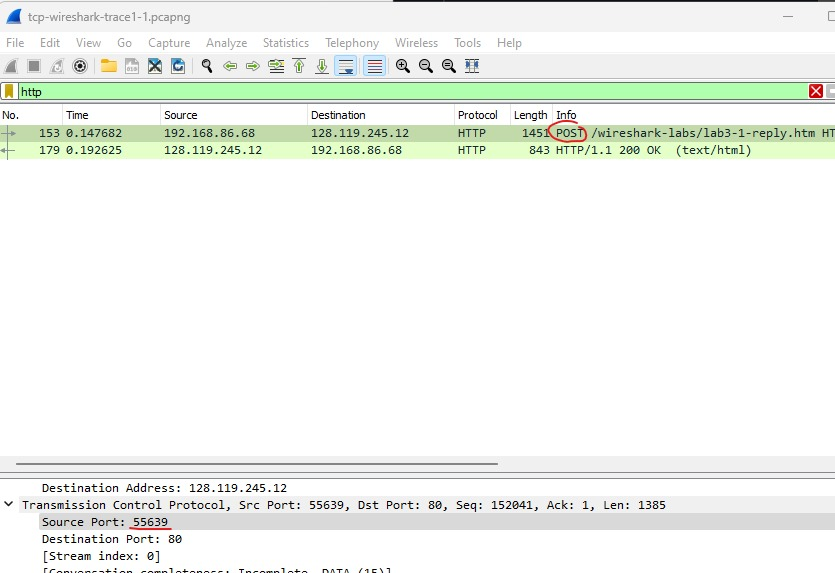
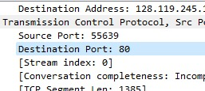
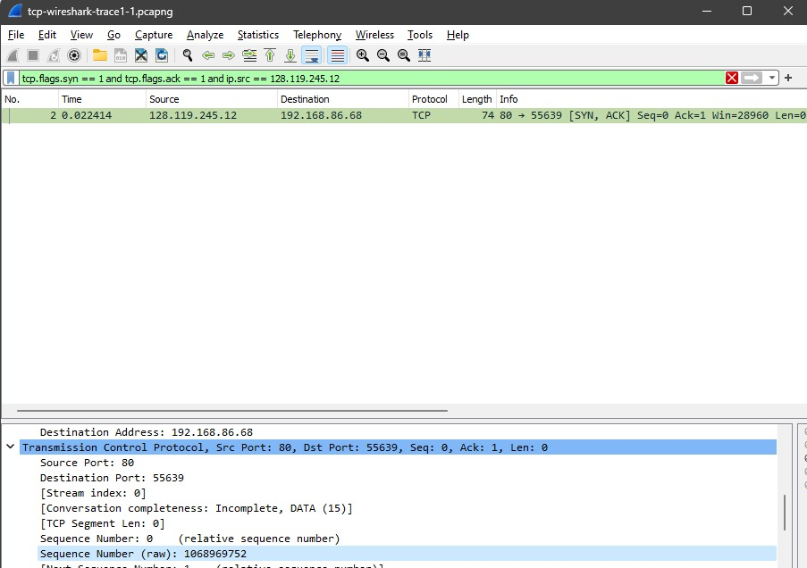
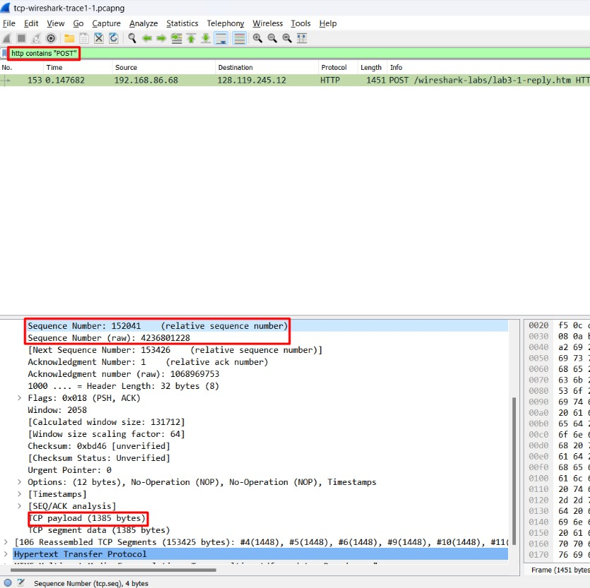
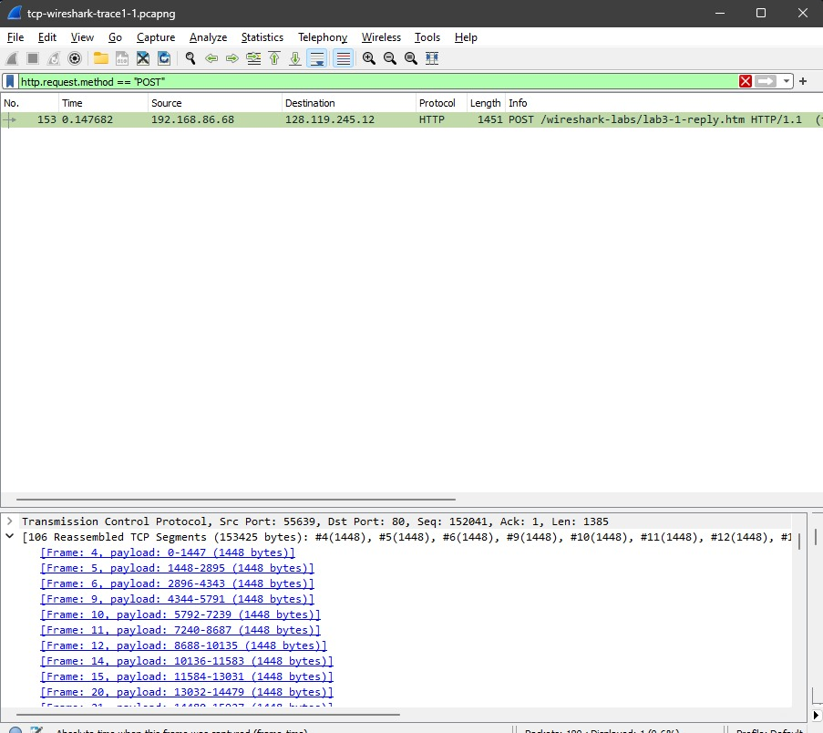
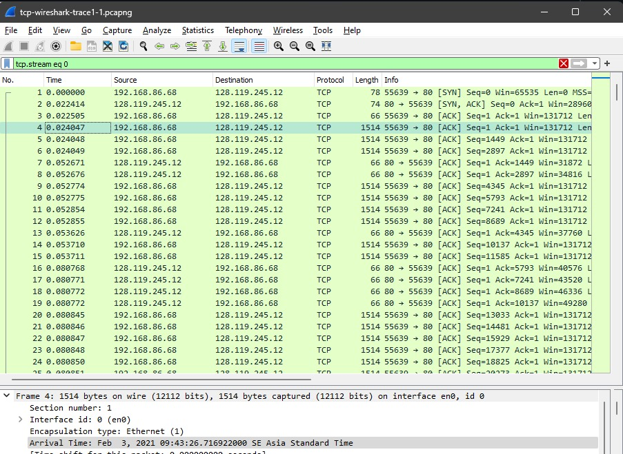
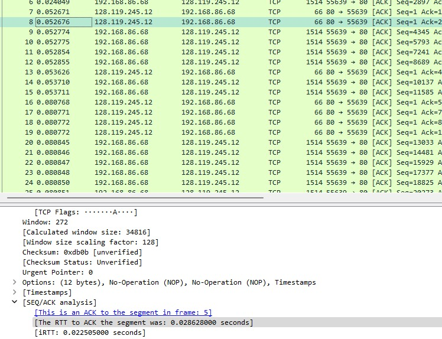
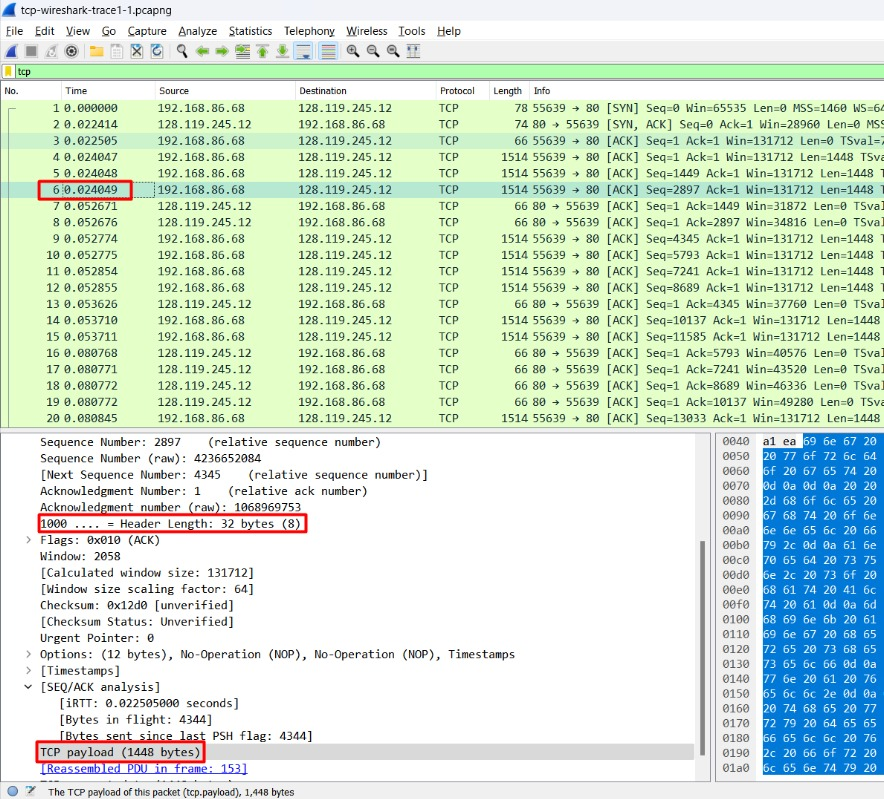
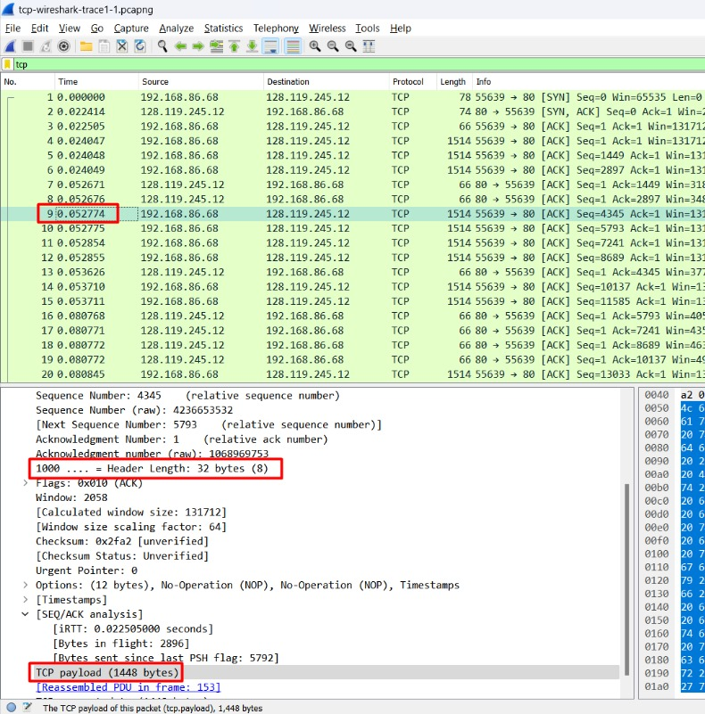

# Jarkom Wireshark TCP & UDP

Perkenalkan saya dari kelas `Jaringan Komputer D`:

| Nama                   | NRP        |
| ---------------------- | ---------- |
| Daffa Saskara          | 5025211249 |

### Informations

Jaringan Komputer - D Assignemnts. Section 7.

### Sesi Question TCP

### Question 1

> What is the IP address and TCP port number used by the client computer (source) that is transferring the alice.txt file to gaia.cs.umass.edu?

#### Penjelasan
 use the `http.request.method == "POST"` on the filter tab. The filter will only shows you the packet with the HTTP protocol with a POST method.

#### Answer:

Client IP Address: 192.168.86.68

TCP Source Port: 55639

### Question 2

> What is the IP address of gaia.cs.umass.edu? On what port number is it sending and receiving TCP segments for this connection?

#### Penjelasan

The same with the last question. but we only have to see the ports.

#### Answer:

Destination Port: 80

### Question 3

> What is the sequence number of the TCP SYN segment that is used to initiate the TCP connection between the client computer and gaia.cs.umass.edu?

#### Penjelasan

Insert the `tcp.flags.syn == 1 and ip.dst == 128.119.245.12` filter on the display filter. this filter will show you the package with flag TCP SYN and was directed to gaia.cs.umass.edu.

#### Answer:

Sequence Number: 0

Sequence Number (raw): 42366491871068969753

### Question 4

> What is the sequence number of the SYNACK segment sent by gaia.cs.umass.edu to the client computer in reply to the SYN? What is it in the segment that identifies the segment as a SYNACK segment? What is the value of the Acknowledgement field in the SYNACK segment? How did gaia.cs.umass.edu determine that value?

#### Explanation

insert the filter `tcp.flags.syn == 1 and tcp.flags.ack == 1 and ip.src == 128.119.245.12` on the display filter.

**Raw Sequence Number**

Seq Number(raw) is 10689752

**SYN/ACK Segment**

After filtering the details in the provided packet, it is evident that the segment is an SYN/ACK segment, which is utilized during the TCP connection initiation process due to both flags being set to 1.

**Acknowledgement Field**

From the two photos above, we can observe that the Acknowledge Field value in the packet is 1.

#### Answer:

### Question 5

> What is the sequence number of the TCP segment containing the header of the HTTP POST command?

``Sequence Number: 152041    (relative sequence number)
Sequence Number (raw): 4236801228
TCP payload (1385 bytes)``

#### Answer:

Sequence Number: 152041    (relative sequence number)
Sequence Number (raw): 4236801228
TCP payload (1385 bytes)

### Question 6

> Consider the TCP segment containing the HTTP “POST” as the first segment in the data transfer part of the TCP connection:
>
> - At what time was the first segment (the one containing the HTTP POST) in the data-transfer part of the TCP connection sent?
> - At what time was the ACK for this first data-containing segment received?
> - What is the RTT for this first data-containing segment?

#### Explanation & Answers

Take into account the TCP segment that includes the HTTP "POST" as the initial segment in the data transfer phase of the TCP connection.

> - At what time was the first segment (the one containing the HTTP POST) in the data-transfer part of the TCP connection sent?

``Frame 4 = 0.024047 sec``

> - At what time was the ACK for this first data-containing segment received?

``Frame 7	= 0.052671 sec``

> - What is the RTT for this first data-containing segment?

``The RTT to ACK the segment was: 0.028624000 seconds``

> - What is the RTT value the second data-carrying TCP segment and its ACK?

``The RTT to ACK the segment was: 0.028628000 seconds``

### Question 7

> What is the length (header plus payload) of each of the first four data-carrying TCP segments?

#### Explanation

The following consists of four packets that transport TCP segments, specifically labeled as Frame 4, 5, 6, and 9.

> - Frame 4

``Frame 4: Header Length: 32 bytes + TCP payload: 1448 bytes = 1480 bytes``

> - Frame 5

``Frame 5: Header Length: 32 bytes + TCP payload: 1448 bytes = 1480 bytes``

> - Frame 6

``Frame 6: Header Length: 32 bytes + TCP payload: 1448 bytes = 1480 bytes``

> - Frame 9

``Frame 9: Header Length: 32 bytes + TCP payload: 1448 bytes = 1480 bytes``

### Sesi Question UDP

### Question 1
>Select the first UDP segment in your trace. What is the packet number4 of this segment in the trace file?  What type of application-layer payload or protocol message is being carried in this UDP segment?  Look at the details of this packet in Wireshark.  How many fields there are in the UDP header?

#### Explanation

#### Answer:

### Question 2
>By consulting the displayed information in Wireshark’s packet content field for this packet (or by consulting the textbook), what is the length (in bytes) of each of the UDP header fields?

#### Explanation

#### Answer:

### Question 3

#### Explanation

#### Answer:

### Question 4
>What is the maximum number of bytes that can be included in a UDP payload?

#### Answer:

### Question 5
>What is the largest possible source port number?

#### Answer:

### Question 6
>What is the protocol number for UDP? Give your answer in decimal notation.

#### Answer:

### Question 7
>Examine the pair of UDP packets in which your host sends the first UDP packet and the second UDP packet is a reply to this first UDP packet. (Hint: for a second packet to be sent in response to a first packet, the sender of the first packet should be the destination of the second packet).  What is the packet number5 of the first of these two UDP segments in the trace file?  What is the packet number6 of the second of these two UDP segments in the trace file? Describe the relationship between the port numbers in the two packets

#### Answer:
